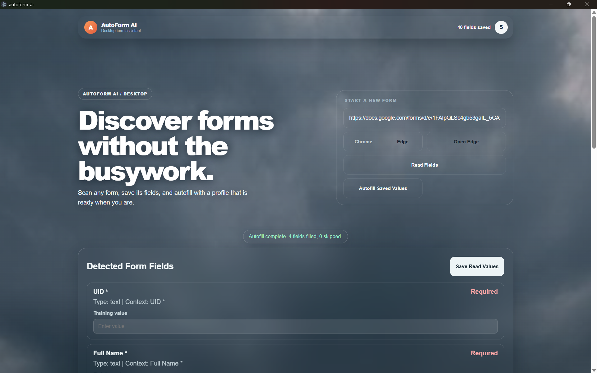
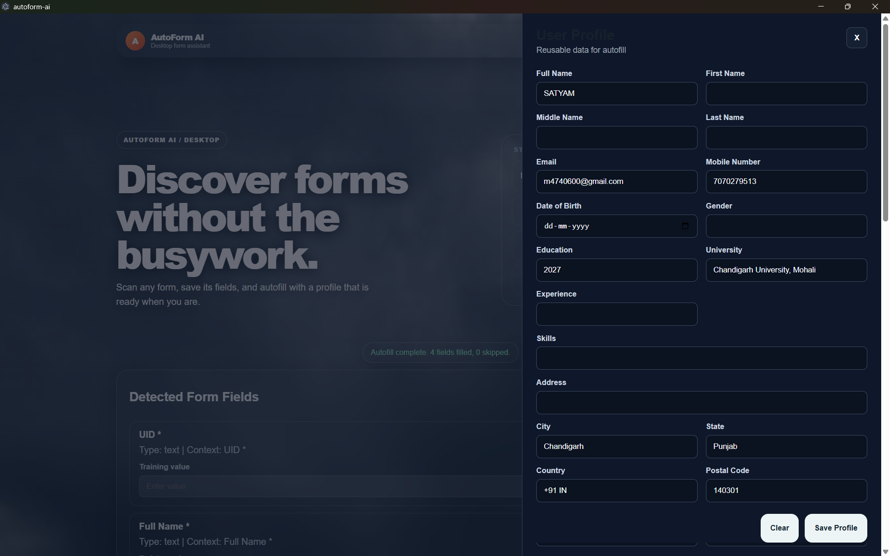

# 🚀 AutoForm AI

> **A Smart Desktop Application for Automated Web Form Filling**

AutoForm AI is a desktop application that simplifies online form filling by automatically entering saved user information into supported websites. Built with **React**, **Electron**, **TypeScript**, **Playwright**, and **SQLite**, it helps users save time by eliminating repetitive manual data entry.

---

## ✨ Key Features

- 📝 Save personal and professional profile information
- ⚡ Automatically fill online forms
- 🌐 Browser automation powered by Playwright
- 💻 Cross-platform desktop application using Electron
- 💾 Local profile storage with SQLite
- 🔒 Secure local data management
- 🎯 Clean and user-friendly interface
- 🔄 Reusable profile for multiple websites

---

# 📸 Screenshots

## 🔐 Login Screen


---

## 🏠 Main Dashboard



---

## 👤 User Profile



---

# 🛠 Tech Stack

| Technology | Purpose |
|------------|---------|
| React | User Interface |
| TypeScript | Type Safety |
| Vite | Fast Development |
| Electron | Desktop Application |
| Playwright | Browser Automation |
| SQLite | Local Database |
| Node.js | Runtime Environment |

---

# ⚙️ How It Works

1. User enters profile information.
2. Profile is stored locally.
3. User opens a supported website.
4. Playwright detects form fields.
5. AutoForm AI automatically fills matching fields.
6. User saves time with one-click automation.

---

# 📂 Project Structure

```
AutoForm AI
│
├── src
│   ├── main
│   ├── renderer
│   ├── shared
│
├── scripts
├── screenshot
├── dist-electron
└── package.json
```

---

# 🚀 Installation

### Clone Repository

```bash
git clone https://github.com/Satyam0202/AutoForm.git
```

### Install Dependencies

```bash
npm install
```

### Run Project

```bash
npm run dev
```

### Install Playwright Browsers

```bash
npx playwright install
```

---

# 📜 Available Scripts

```bash
npm run dev
```

Runs the application in development mode.

```bash
npm run build
```

Builds the React application.

```bash
npm run build:electron
```

Builds the Electron desktop application.

```bash
npm run preview
```

Previews the production build.

```bash
npm run lint
```

Runs ESLint.

---

# 🎯 Future Improvements

- 🤖 AI-based field detection
- 📄 Resume parsing
- ☁️ Cloud synchronization
- 👥 Multiple user profiles
- 🌍 Browser extension support
- 🔐 User authentication
- 📊 Dashboard analytics

---

# 📌 About

AutoForm AI was developed as an academic project to explore desktop application development, browser automation, and modern web technologies. The project demonstrates how browser automation can reduce repetitive work and improve productivity.

---

⭐ If you like this project, don't forget to give it a star.
